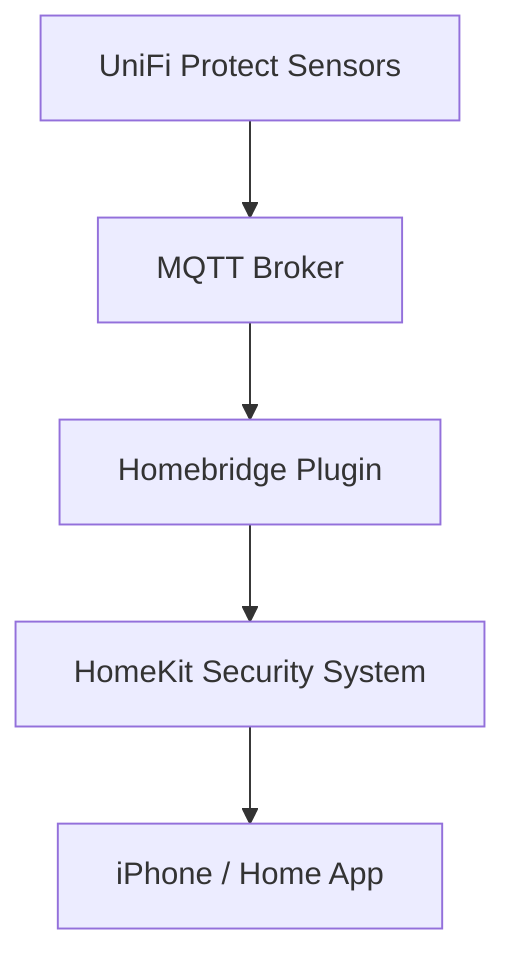
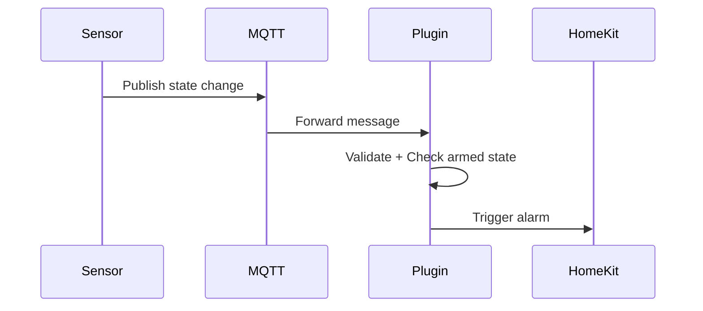

# Homebridge MQTT UniFi Protect Alarm


A Homebridge dynamic platform plugin that creates a **HomeKit Security System** using MQTT events from UniFi Protect sensors. 

This plugin relies on **Homebridge-unifi-protect** plugin for the way it publishes topics to MQTT so please install that first.

## Features

- 🏠 Home (Stay) arming  
- 🚗 Away arming  
- ⏱ Global exit delay  
- ⏱ Per-sensor entry delay  
- 🚨 Configurable alarm duration  
- 📡 MQTT-based triggering  
- 🔔 Proper HomeKit alarm state updates  
- 🧱 Fully compatible with child bridge mode  


# Installation

Install via Homebridge UI or manually:

```
npm install -g homebridge-mqtt-unifi-protect
```

Restart Homebridge after installation.

---

# Example Configuration

```json
{
  "platform": "MqttUnifiProtectPlatform",
  "alarmName": "Home Alarm",
  "mqttHost": "192.168.1.10",
  "mqttPort": 1883,
  "mqttUsername": "mqttuser",
  "mqttPassword": "mqttpass",
  "exitDelay": 30,
  "alarmDuration": 120,
  "devices": [
    {
      "name": "Front Door",
      "mac": "AABBCCDDEEFF",
      "type": "contact",
      "armHome": false,
      "armAway": true,
      "entryDelay": 15
    },
    {
      "name": "Living Room Motion",
      "mac": "112233445566",
      "type": "motion",
      "armHome": true,
      "armAway": true,
      "entryDelay": 0
    }
  ]
}
```

---

# Configuration Reference

## Global Settings

| Setting | Description |
|----------|-------------|
| alarmName | Name shown in HomeKit |
| mqttHost | MQTT broker hostname or IP |
| mqttPort | MQTT port (default 1883) |
| mqttUsername | MQTT username (optional) |
| mqttPassword | MQTT password (optional) |
| exitDelay | Seconds before system arms |
| alarmDuration | Seconds alarm remains triggered |

---

## Device Settings

| Setting | Description |
|----------|-------------|
| name | Display name |
| mac | MAC address (colons optional, automatically normalized) |
| type | contact or motion |
| armHome | Armed in Home mode |
| armAway | Armed in Away mode |
| entryDelay | Entry delay in seconds |

---

# MQTT Behavior

The plugin subscribes to:

```
#
```

It matches devices when their MAC address appears in the topic.

Accepted trigger payloads:

- true  
- 1  
- open  
- motion  

Example:

Topic:
```
unifi/AABBCCDDEEFF/state
```

Payload:
```
open
```

---

# How It Works

1. MQTT message received  
2. MAC address matched to configured device  
3. System checks:
   - Is alarm armed?
   - Is sensor allowed in this mode?
4. If allowed:
   - Entry delay (if configured)
   - Alarm triggers
5. After `alarmDuration`, system resets to armed state  

---

# Disarmed Behavior

When the system is disarmed:

- All sensors are ignored  
- No monitoring occurs  
- No alarm events are triggered  

This version does **not** include a monitor-when-off mode.

---

# Architecture Overview

- 1 HomeKit Security System accessory  
- MQTT event-driven  
- Dynamic platform plugin  
- Child bridge compatible  
- No polling  

---

## Architecture Diagram



---

## MQTT Flow



---

# Debug Logging

Example log output:

```
[homebridge-mqtt-unifi-protect] MQTT broker connected successfully.
[homebridge-mqtt-unifi-protect] Exit delay started: 30s
[homebridge-mqtt-unifi-protect] Alarm triggered by sensor: Front Door
[homebridge-mqtt-unifi-protect] Alarm reset after duration.
```

---

# Project Structure

```
homebridge-mqtt-unifi-protect/
├── platform.js
├── config.schema.json
├── package.json
├── README.md
└── images/
```

---

# Publishing to npm

Make sure your `package.json` includes:

```json
{
  "name": "homebridge-mqtt-unifi-protect",
  "keywords": [
    "homebridge-plugin",
    "homebridge",
    "mqtt",
    "unifi",
    "security",
    "alarm",
    "homekit"
  ],
  "engines": {
    "homebridge": ">=1.6.0",
    "node": ">=18.0.0"
  }
}
```

Then publish:

```
npm login
npm publish --access public
```

---

# Compatibility

- Homebridge v1.6+  
- Node.js 18+  
- MQTT v3 brokers  
- UniFi Protect MQTT bridge setups  

---

# Security Notes

- MQTT credentials are optional but recommended  
- Use a secured broker when possible  
- Avoid exposing MQTT publicly without TLS  

---

# License

MIT License

---

# Author

Developed for advanced UniFi Protect + MQTT integrations with HomeKit.

---

# Roadmap Ideas

- Sensor-specific notifications  
- Push notification identification  
- Panic mode  
- Tamper detection  
- Zone grouping  
- Optional per-sensor HomeKit accessories  

Enjoy your fully MQTT-driven HomeKit alarm system 🚨
